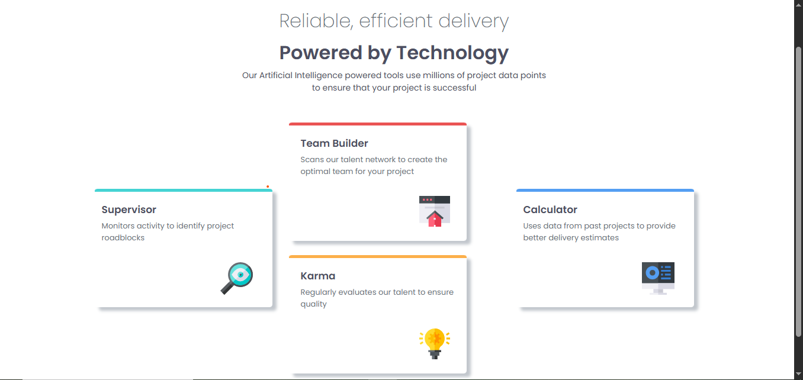
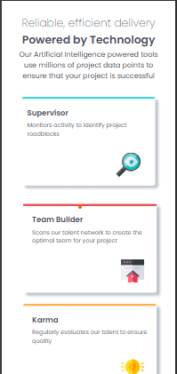

# 🌟 Four Card Feature Section

A clean and modern **responsive layout** built for the [Frontend Mentor Challenge](https://www.frontendmentor.io/challenges/four-card-feature-section-weK1eFYK).  
This project showcases a **four-card grid layout** with hover effects, beautiful colors, and mobile-first responsiveness.

---

## 📸 Screenshot

### Desktop View 🖥️


### Mobile View 📱


---

## 🔗 Live Demo

- **Solution URL:** [View on Frontend Mentor](https://www.frontendmentor.io/solutions)  
- **Live Site URL:** [View Live Project](https://four-card-section-bwll.vercel.app/)

---

## 💻 Built With

- Semantic **HTML5** markup  
- **CSS3** (Flexbox & Grid)  
- **Bootstrap 5** (responsive grid system)  
- **Google Fonts** (Poppins family)  
- Mobile-first workflow  

---

## 🎯 Features

✅ Fully responsive (mobile and desktop)  
✅ Clean & modern design  
✅ Custom card borders with theme colors  
✅ Lightweight and fast  
✅ Semantic and accessible HTML  

---

## 🧠 What I Learned

While building this project, I learned:

- How to use **Bootstrap grid system** with custom CSS.  
- Creating a **card layout** that adjusts for desktop and mobile.  
- Using **Google Fonts (Poppins)** with multiple weights.  
- Managing **box-shadow** and subtle hover effects for modern UI.  

---

## 🚀 How to Run Locally

1. Clone this repository:

```bash
git clone https://github.com/dawood125/Four_card_Section
```
2.  Open the project folder :

cd four-card-feature-section


Run the project by simply opening index.html in your browser.


## 📚 Useful Resources

- [Bootstrap 5 Docs](https://getbootstrap.com/docs/5.3/getting-started/introduction/) – for flexbox/grid utilities.  
- [Google Fonts](https://fonts.google.com/) – for Poppins.  
- [Frontend Mentor](https://www.frontendmentor.io) – great platform for practicing real-world UI components.  

---

## 👨‍💻 Author

- GitHub – [Dawood Ahmed](https://github.com/dawood125)  
- Frontend Mentor – [@Dawood Ahmed](https://www.frontendmentor.io/profile/dawood125)  

---
